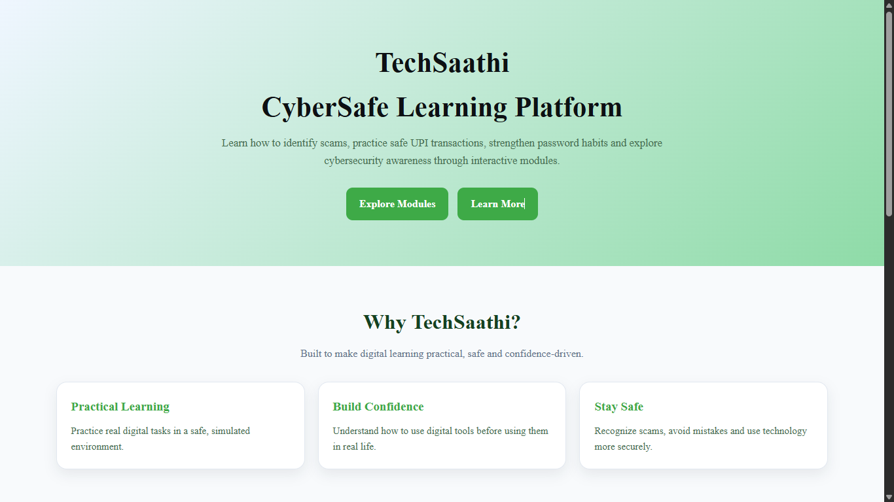
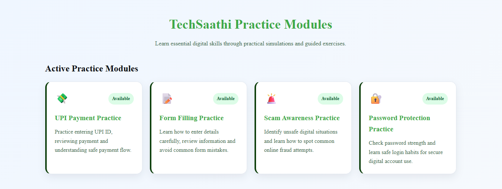

 # TechSaathi

**TechSaathi** is a privacy-first digital literacy web prototype that helps beginners practice essential online tasks like UPI payments, form filling, scam awareness and password safety — all in a safe, guided environment.

---

## Features

- **UPI Payment Practice** – Simulated digital payment experience for beginners.  
- **Form Filling Practice** – Learn to complete online forms confidently and accurately.  
- **Scam Awareness** – Identify suspicious messages, fake offers, and digital fraud patterns.  
- **Password Protection** – Understand secure password habits and account safety practices.

---

## Privacy

> We **do not store any user data**. All interactions remain local on your device.

---

## Screenshots

**Homepage / Main Screen**  
  

**Modules**

**UPI Payment Practice**  
  

**Footer Section**  
  

**Mobile View**  

---

## Live Demo

Check it out here: [TechSaathi Live](https://Brahm2008.github.io/TechSaathi/)

---

## Usage

1. Clone or download this repository.  
2. Open `index.html` in any modern browser.  
3. Navigate through modules and practice safely.

---

## License

Free to use for educational and portfolio purposes.
